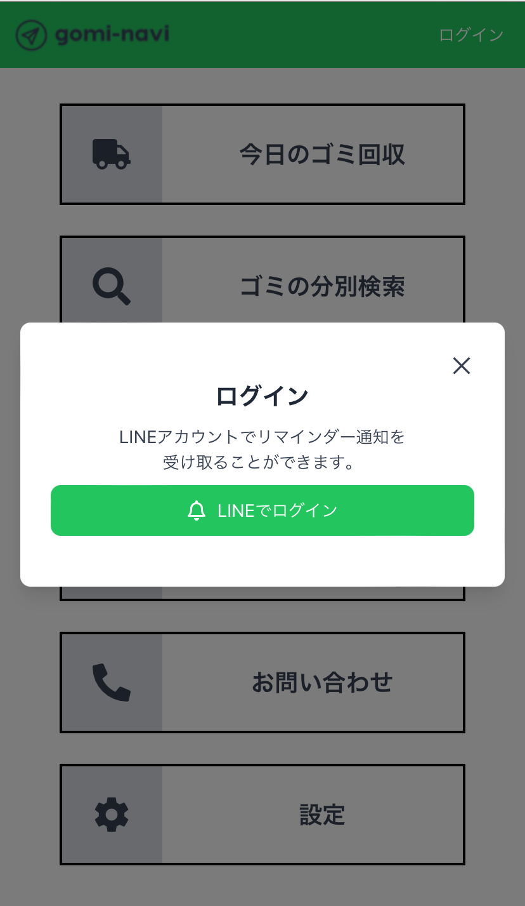

## gomi-navi / ゴミ分別アプリ
現在README.mdを作成中です。

## サービスの概要

gomi-naviは、「ゴミの捨て忘れを防止したい」という想いから作成された、無料のゴミ分別アプリです。  ユーザーはLINEでログインし、公式アカウントを友だち追加することで、リマインダー通知をLINEで受け取ることができます。  ログインを行わなくてもゴミの種類別の捨て方、地域別の本日の回収項目、ゴミの捨て方検索、1週間のゴミ回収スケジュール機能を利用することができます。  モバイルでの利用も想定し対応しています。

### サービスのURL

  [https://gomi-navi.net/](https://gomi-navi.net/)
  ログインしなくてもメモ機能以外の操作が使用可能です。
  レスポンシブ対応済みのため、PCとスマートフォンどちらでも利用可能です。

### テーマ

[テーマはこちら](documents/THEMA.md)

### 要件定義

[要件定義はこちら](documents/REQUIREMENT_DEFINITION.md)

### 業務フローチャート

[業務フローチャートはこちら](documents/業務フローチャート.png)

## 画面遷移図

## ER図

## 使用技術一覧

### フロントエンド

- React: 18.3.1

### バックエンド

- PHP: 8.2
- Laravel: 11.9

### ライブラリ

#### ビルドツール

- vite: ^5.0
- laravel-vite-plugin: ^1.0

#### データフェッチ関連

- Axios: ^1.7.2

#### UI関連

- tailwindcss: ^3.4.4
- react-icons: ^5.2.1
- preline: ^2.3.0

#### 認証関連

- js-cookie: ^3.0.5
- laravel/sanctum: ^4.0
- laravel/socialite: ^5.15
- socialiteproviders/line: ^4.1

#### LINE関連

- linecorp/line-bot-sdk: ^9.9

#### データベース

- MySQL:8.0.35

#### インフラ

- AWS (Route53 / Certificate Manager/ ELB( Application Load Balancer ) / VPC / EC2 / RDS MySQL)  / Apache

### バージョン管理

- Git/GitHub

## 機能一覧

| トップ画面ページ |　ログイン画面ページ |　今日のゴミ回収ページ|
| ---- | ---- | ----|
|  |  | |
| <ul><li>会員登録をしなくてもメモ機能以外の部分は使えるようになっています。</li></ul> | <ul><li>LINEを使用した認証機能を実装しました。</li><li>ユーザーIDや表示名、メールアドレス等の個人情報は取得しません。</li></ul> | 今日のゴミ回収項目を確認することができます。|

| ゴミのアイテム別分別検索ページ| カレンダーページ| ゴミの種類別捨て方検索ページ|
| ---- | ---- | ----|
|  |  | |
| <ul><li>アイテム別に捨て方を検索できる機能を実装しました。</li><li>フィルター機能によりカテゴリー別での検索ができます。</li><li>ワード検索ができます。</li></ul> | <ul><li>曜日ごとのゴミ回収項目を確認することができます。</li></ul> | <ul><li>種類別にゴミの捨て方を確認することができます。</li></ul> |

| お問い合わせページ | 設定ページ | メモの新規作成 |
| ---- | ---- | ----|
|  |  |  |
| <ul><li>ゴミの分別や収集に関するお問い合わせ一覧を確認できます。</li></ul> | <ul><li>地域設定の登録や利用規約、プライバシーポリシーを見ることができます。</li></ul> | <ul><li>ログインされている方のみメモ機能を利用することができます。</li><li>タイトルと内容を入れ、メモを作成することができます。</li></ul> |

## インフラ構成図

## 今後の展望

現在はデフォルトの地域のみで開発を行っています。今後川崎市全区を対象にサービスを拡大していきたいと考えています。
実装予定の機能
