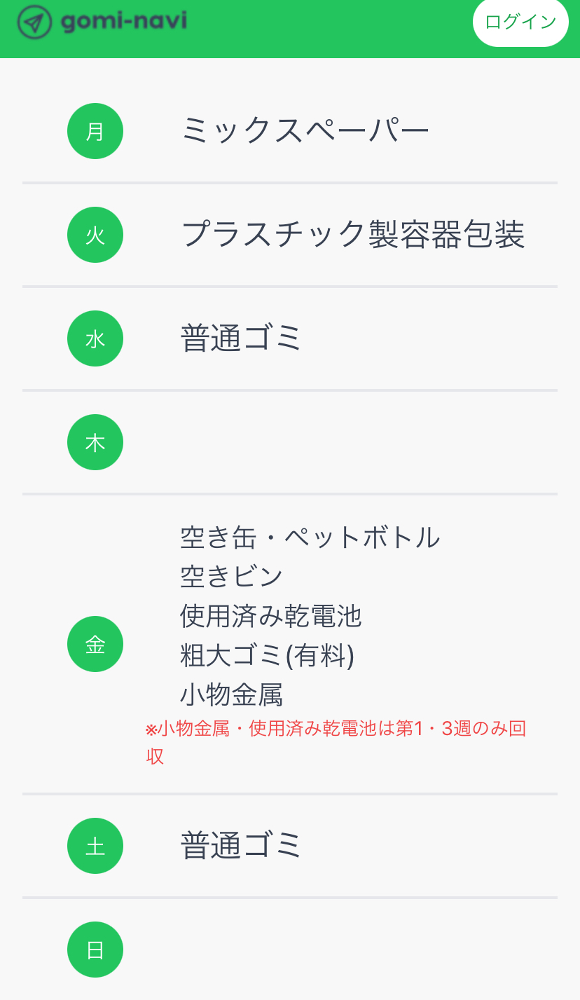

## gomi-navi / ゴミ分別アプリ
現在README.mdを作成中です。

### サービスの概要

gomi-naviは、「ゴミの捨て忘れを防止したい」という想いから作成された、無料のゴミ分別アプリです。  ユーザーはLINEでログインし、公式アカウントを友だち追加することで、リマインダー通知をLINEで受け取ることができます。  ログインを行わなくてもゴミの種類別の捨て方、地域別の本日の回収項目、ゴミの捨て方検索、1週間のゴミ回収スケジュール機能を利用することができます。  モバイルでの利用も想定し対応しています。

### サービスのURL

ログインしなくてもメモ機能以外の操作が使用可能です。  [https://gomi-navi.net/](https://gomi-navi.net/)

### 機能一覧

| トップ画面ページ |　ログイン画面ページ |
| ---- | ---- |
|  |  |
| 会員登録をしなくてもメモ機能以外の部分は使えるようになっています。 | LINEを使用した認証機能を実装しました。  ユーザーIDや表示名、メールアドレス等の個人情報は取得しません。 |

| 今日のゴミ回収ページ |　ゴミの分別検索ページ |
| ---- | ---- |
|  |  |
| 今日のゴミ回収項目を確認することができます。 | アイテム別に捨て方を検索できる機能を実装しました。フィルター機能によりカテゴリー別での検索、ワード検索ができます。 |

| カレンダーページ |　ゴミの捨て方ページ |
| ---- | ---- |
|  |  |
| 曜日ごとのゴミ回収項目を一目で確認することができます。 | 種類別にゴミの捨て方を確認することができます。 |

| お問い合わせページ |　設定ページ |
| ---- | ---- |
|  |  |
| ゴミの分別や収集に関するお問い合わせ一覧を確認できます。 | 地域設定の登録や利用規約、プライバシーポリシーを見ることができます。 |

| メモの新規作成 |　 |
| ---- | ---- |
|  |  |
| タイトルと内容を入れ、メモを作成することができます。 |  |

 

### 使用技術一覧

| カテゴリー  | 使用技術                              |
| --------------- | ------------------------------------- |
| **バックエンド** | PHP: 8.2  Laravel: 11.9         |
| **フロントエンド** | - React: 18.3.1  Tailwind CSS    |
| **データベース** | MySQL:8.0.35   |
| **インフラ**    | AWS (Route53 / Certificate Manager / VPC / EC2 / RDS MySQL)  Apache |
| **デザイン** | miro  Figma    |

## インフラ構成図

## 今後の展望
現在はデフォルトの地域のみで開発を行っています。今後川崎市全区を対象にサービスを拡大していきたいと考えています。
